# Better Stack Ops

<p></p>

**Move from monitor state to the logs that explain it.**



A standalone skill for **Codex · Claude Code · Cursor**, backed by a portable Python CLI.
Independent community project; not affiliated with or endorsed by the provider.

## ✨ What it does

- Use dedicated credentials for Uptime, Telemetry and Errors so account scopes stay explicit.
- Inspect monitors, status pages, heartbeats, incidents, sources and applications with typed shortcuts.
- Query SQL through the official connection endpoint using private credentials, bounded result size and a timeout; parse curl connection samples as data, never shell code.

## 🚀 Install

Requires Node.js **22.20+** for the tested skills installer.

```sh
npx skills@1.7.1 add joeeeeey/betterstack-ops --agent codex claude-code cursor --yes
```

[View on skills.sh](https://skills.sh/joeeeeey/betterstack-ops/betterstack-ops)

Then ask your agent to use **betterstack-ops**. The standard SKILL.md and bundled CLI are the
portable interface; no dependency on another personal skill is needed.

## 🔎 Try it

From the installed skill directory, or a repository checkout:

```sh
python3 scripts/betterstack_api.py uptime monitors --summary
python3 scripts/betterstack_api.py telemetry sources --summary
python3 scripts/betterstack_api.py delete uptime /monitors/MONITOR_ID
```

Python 3.10+. Set `BETTERSTACK_UPTIME_TOKEN`, `BETTERSTACK_TELEMETRY_TOKEN` and/or `BETTERSTACK_ERRORS_TOKEN` (each supports `_FILE`). No fallback between API areas. SQL uses `--config /private/path/sql.json` with host, username and password from Better Stack's Connect remotely page; REST tokens are not SQL passwords.

Run `python3 scripts/betterstack_api.py --help` for all commands.
Use a secret manager or a private local file for credentials; avoid pasting values into shell history.

## How to use it well

Select the API area and account explicitly. Read monitor state and recent incidents, then narrow a log query to the relevant time window. Preview requested REST writes; --execute sends once. SQL permits a SELECT/WITH/DESCRIBE/SHOW prefix and one statement, but this is not a SQL security parser: use provider-enforced read-only credentials and inspect queries, especially table functions.

## 🧪 Compatibility and verification

| Layer | Scope |
| --- | --- |
| Runtime | Python 3.10+; dependency-free standard library helpers |
| Agent interface | Standard SKILL.md + relative scripts; Codex, Claude Code, Cursor |
| Offline verification | Synthetic fixtures and mocks; run `python3 -m unittest discover -s tests -v` |
| Installation / native execution | See [validation evidence](references/validation.md) for exact tested levels |
| Live account operations | Not exercised as part of this release |

The illustration uses declarative SVG animation, with a readable static state and reduced-motion
fallback. It contains no JavaScript, external font or remote image dependencies.

## Limits and data handling

Single-page REST responses; use --param page=... where supported. SQL results can contain sensitive logs and must not be published blindly. SQL connections are separate from REST tokens. No automatic monitor creation from vague alert requirements; generic writes need an exact provider payload.

Secret-like fields and configured credential values are redacted where supported. Ordinary
resource names, logs and account metadata may still be private: review output before sharing.

[Official documentation and API notes](references/api.md) · [MIT license](LICENSE)

## Provenance

Extracted and maintained from the author's existing local skill implementation, with
account-specific defaults and private operational notes removed. Documentation, fixtures and
workflow SVG artwork in this distribution are original. Provider marks are attributed in
[brand sources](assets/BRAND-SOURCES.md) and excluded from the MIT license. External runtimes and provider services retain
their own licenses and terms; this repository does not redistribute them.
